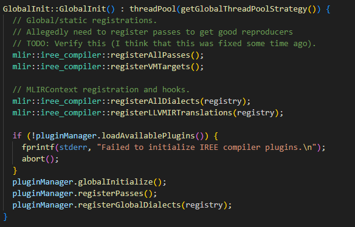
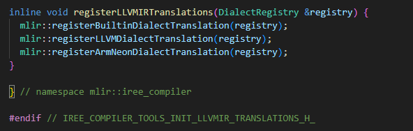

- 함수를 들어가면, 아래 Globalnit 함수가 등장
- 이 함수에서 모든 pass, target, dialect, pass 들과 plugin으로 개발한 dialect와 pass들도 호출되는 것을 볼 수 있음
  
- 해당 함수들을 탐색하면 어떤 Dialect 및 Pass들이 등록되어 있는지, target이나 plugin을 등록하는 방법이 무엇인지 찾을 수 있을 것

## 1. registerAllPasses
 - 크게 3가지 종류의 Pass가 등록
```
  registerAllIreePasses();
  registerCodegenPasses();
  registerMlirPasses();   
```

### 1.1 registerAllIreePasses
- 전체적으로 Import MLIR로부터 Flow-Stream-HAL을 포함한 최적화까지 수행
- 등록된 Pass들을 Tree로 표현
- 참조 기본경로 /path/to/iree/compiler/src/iree/compiler/
```
registerAllIreePasses
├── IREE
│   ├── ABI
│   │   ├── registerPasses (~/Bindings/Native/Transform/Passes.td)
│   │   └── registerTransformPassPipeline
│   ├── TFLite
│   │   ├── registerPasses (~/Binding/TFLite/Transforms/Passes.td)
│   │   └── registerTransformPassPipeline
│   ├── Flow
│   │   └── registerFlowPasses (~/Dialect/Flow/Transforms/Passes.td)
│   ├── HAL
│   │   ├── registerHALPasses (~/Dialect/HAL/Transforms/Passes.td)
│   │   ├── Inline
│   │   │   └── registerHALInlinePasses (~/Dialect/HAL/Inline/Transforms/Passes.td)
│   │   └── Loader
│   │       └── registerHALLoaderPasses (~/Dialect/HAL/Loader/Transforms/Passes.td)
│   ├── IO
│   │   └── Parameters
│   │       └── registerParametersPasses (~/Modules/IO/Parameters/Transforms/Passes.td)
│   ├── LinalgExt
│   │   └── registerPasses (~/Dialect/LinalgExt/Transforms/Passes.td)
│   ├── Stream
│   │   └── registerStreamPasses (~/Dialect/Stream/Transforms/Passes.td)
│   ├── Util
│   │   └── registerUtilPasses (~/Dialect/Util/Transforms/Passes.td)
│   ├── VM
│   │   ├── registerVMPasses (~/Dialect/VM/TransForms/Passes.td)
│   │   └── registerVMAnalysisTestPasses
│   └── VMVX
│       └── registerVMVXPasses (~/Dialect/VMVX/Transforms/Passes.td)
├── InputConversion
│   └── registerCommonInputConversionPasses (~/InputConversion/Common/Passes.td)
├── ConstEval
│   └── registerConstEvalPasses (~/ConstEval/Passes.td)
├── GlobalOptimization
│   └── registerGlobalOptimizationPipeline (~/GlobalOptimization/Passes.td)
├── DispatchCreation
│   ├── registerDispatchCreationPipelines (~/DispatchCreation/Passes.td)
│   └── registerDispatchCreationPasses 
└── Preprocessing
    └── registerPreprocessingPasses (~/Preprocessing/Common/Passes.td)

```
- 최종 pass들 목록화
```
[IREE:ABI]
ConvertStreamableOpsPass
WrapEntryPointsPass

InlinerPass
CanonicalizerPass
CSEPass
SymbolDCEPass

[IREE::TFLite]
WrapEntryPointsPass
    
[InputConversion]
IREEImportPublicPass
ImportMLProgramPass
SanitizeModuleNamesPass
AutoInputConversionPipelinePass
DemoteI64ToI32Pass
DemoteF32ToF16Pass
DemoteF64ToF32Pass
PromoteF16ToF32Pass
PromoteBF16ToF32Pass
IREE::Flow::ConvertShardToFlowPass -> IREE에서 코드 수정 해야하는 부분

[ConstEval]
JitGlobalsPass

[GlobalOptimization] ***
너무 많음. /path/to/iree/compiler/src/iree/compiler/GlobalOptimization 참고

[DispatchCreation] ***
너무 많음. /path/to/iree/compiler/src/iree/compiler/DispatchCreation 참고

[Preprocessing]
ApplyPDLPatternsPass
AttrBasedPipelinePass
ConvertConv2DToImg2ColPass
ConvertConvFilterToChannelsLastPass
ConvertConvToChannelsLastPass
FoldAttentionWithTransposePass
InterpreterPass
MakeSingleDispatchForFunctionPass
PadToIntrinsicsPass
PadLinalgOpsPass
TransposeMatmulPass
GeneralizeLinalgMatMulPass
SinkTransposeThroughPadPass

[IREE::Flow]
AnnotateDispatchesPass
CanonicalizePass
CaptureDynamicDimsPass
CleanupTensorShapesPass
ConvertShardToFlowPass
ConvertToFlowPass
DeduplicateExecutablesPass
DumpDispatchGraphPass
ExportBenchmarkFuncsPass
InitializeEmptyTensorsPass
InjectDispatchTracingPass
InjectTensorTracingPass
InsertDebugTargetAtSymbolPass
InsertDebugTargetAtOrdinalPass
OutlineConstantsPass
OutlineDispatchExternsPass
OutlineDispatchRegionsPass
ReplicateGlobalsPerAffinityPass
TopLevelSCFToCFGPass
VerifyInputLegalityPass

[IREE::HAL] *****
너무 많음. /path/to/iree/compiler/Dialect/HAL/Transforms 참고

[IREE::HAL::Inline]
ConversionPass
InlineExecutablesPass

[IREE::HAL::Loader]
ConversionPass
MaterializeExecutablesPass
ResolveExportOrdinalsPass

[IREE::IO::Parameters]
ExportParametersPass
GenerateSplatParameterArchivePass
ImportParametersPass

[IREE::LinalgExt]
LinalgExtToLoopsPass
PadContractionToBlockSizePass
TopkSplitReductionPass
DecomposeMapScatterPass
DecomposeWinogradTransformPass
ConvertConvToIm2ColOpPass
ConvertConv2DToWinogradPass
DecomposeAttentionPass
ConvertAttentionToOnlineAttentionPass
FoldUnitExtentDimsPass
TestReshapeFusionPass
VectorizeIREELinalgExtOpsPass

[IREE::Stream]
너무 많음. /path/to/iree/compiler/src/iree/compiler/Dialect/Stream/Transform/Passes.td 참고

[IREE::Util]
ApplyPatternsPass
AttributeCallGraphPass
CombineInitializersPass
DropCompilerHintsPass
DumpModulePass
FixedPointIteratorPass
IPOPass
LiftCFGToSCFPass
LinkModulesPass
OptimizeIntArithmeticPass
PropagateSubrangesPass
StripAndSplatConstantsPass
StripDebugOpsPass
VerifyInitializationOrderPass
VerifyStructuredControlFlowPass
FoldGlobalsPass
FuseGlobalsPass
HoistIntoGlobalsPass
SimplifyGlobalAccessesPass
ImportResourcesPass
AnnotateOpOrdinalsPass
TestConversionPass
TestFloatRangeAnalysisPass

[IREE::VM]
ConversionPass
ReifyRodataTablesPass
HoistInlinedRodataPass
DeduplicateRodataPass
ResolveRodataLoadsPass
GlobalInitializationPass
OrdinalAllocationPass
DropEmptyModuleInitializersPass
DropUnusedCallsPass
SinkDefiningOpsPass

<test function용 pass>
ValueLivenessTestPass
RegisterAllocationTestPass

[IREE::VMVX]
ConversionPass
MaterializeConstantsPass
ResolveBufferDescriptorsPass


```


### 1.2. registerCodegenPasses
- 실제로 사용될 code를 생산하기 위한 pass들을 등록하는 곳
- 등록된 Pass들을 Tree로 표현
- 참조 기본경로 /path/to/iree/compiler/src/iree/compiler/
```
registerCodegenPasses
├── registerCodegenCommonPasses (~/Codegen/Common/Passes.td)
├── registerCodegenCommonCPUPasses (~/Codegen/Common/CPU/Passes.td)
├── registerCodegenCommonGPUPasses (~/Codegen/Common/GPU/Passes.td)
├── registerCodegenLLVMCPUPasses (~/Codegen/LLVMCPU/Passes.td)
├── registerCodegenLLVMGPUPasses (~/Codegen/LLVMGPU/Passes.td)
├── registerCodegenROCDLPasses (~/Codegen/LLVMGPU/Passes.td)
├── registerCodegenSPIRVPasses (~/Codegen/SPIRV/Passes.td)
├── registerCodegenVMVXPasses (~/Codegen/VMVX/Passes.td)
├── registerCodegenWGSLPasses (~/Codegen/WGSL/Passes.td)
├── registerIREEGPUPasses (~/Codegen/Dialect/GPU/Transform/Passes.td)
└── registerIREEVectorExtPasses (~/Codegen/Dialect/VectorExt/Transforms/Passes.td)
```
- 최종 Pass들을 목록화
```
[CodegenCommonPasses] ***
너무 많음. /path/to/iree/compiler/src/iree/compiler/Codegen/Common/Passes.td 참고

[CodegenCommonCPUPasses]
CPULowerToUKernelsPass
CPUPrepareUkernelsPass
CPUPropagateDataLayoutPass

[CodegenCommonGPUPasses]
너무 많음. /path/to/iree/compiler/src/iree/compiler/codegen/Common/GPU/Passes.td 참고

[CodegenLLVMCPUPasses]
(꽤 많지만 참고할만한 부분이라 모두 작성함)
ConvertToLLVMPass
ExpandF16OpToF32Pass
LLVMCPUAssignConstantOrdinalsPass
LLVMCPUAssignImportOrdinalsPass
LLVMCPUCheckIRBeforeLLVMConversionPass
LLVMCPUEmitVectorizationRemarksPass
LLVMCPULinkExecutablesPass
LLVMCPULowerExecutableTargetPass
LLVMCPUMmt4dVectorLoweringPass
LLVMCPUPeelPass
LLVMCPUSelectLoweringStrategyPass
LLVMCPUSplitReductionPass
LLVMCPUSynchronizeSymbolVisibilityPass
LLVMCPUTilePass
LLVMCPUTileToVectorSizePass
LLVMCPUTileAndFuseProducerConsumerPass
LLVMCPUVerifyVectorSizeLegalityPass
LLVMCPU2DScalableTo1DScalablePass
LLVMCPUUnfuseFMAOpsPass
LLVMCPUVirtualVectorLoweringPass
LLVMCPUVectorTransposeLoweringPass
LLVMCPUVectorShapeCastLoweringPass
VectorContractCustomKernelsPass
VerifyLinalgTransformLegalityPass

[CodegenLLVMGPUPasses]
AMDGPUEmulateNarrowTypePass
ConvertToNVVMPass
ConvertToROCDLPass
ExtractAddressComputationGPUPass
LLVMGPUAssignConstantOrdinalsPass
LLVMGPUCastAddressSpaceFunctionPass
LLVMGPUCastTypeToFitMMAPass
LLVMGPUConfigureTensorLayoutsPass
LLVMGPULinkExecutablesPass
LLVMGPULowerExecutableTargetPass
LLVMGPUPackSharedMemoryAllocPass
ROCDLPrefetchSharedMemoryPass
LLVMGPUSelectLoweringStrategyPass
LLVMGPUTensorCoreVectorizationPass
LLVMGPUTileAndDistributePass
LLVMGPUVectorDistributePass
LLVMGPUVectorLoweringPass
LLVMGPUVectorToGPUPass
TestLLVMGPUScalarizeMathOpPass

[CodegenSPIRVPasses]
ConvertToSPIRVPass
SPIRVAnnotateWinogradLoopsPass
SPIRVBreakDownLargeVectorPass
SPIRVConvertGPUTargetPass
SPIRVEmulateI64Pass
SPIRVEraseStorageBufferStaticShapePass
SPIRVFinalVectorLoweringPass
SPIRVInitialVectorLoweringPass
SPIRVLinkExecutablesPass
SPIRVLowerExecutableTargetPass
SPIRVLowerExecutableUsingTransformDialectPass
SPIRVMapMemRefStorageClassPass
SPIRVMaterializeExecutableConditionsPass
SPIRVSelectLoweringStrategyPass
SPIRVTileAndDistributePass
SPIRVTileAndPromotePass
SPIRVTileToCooperativeOpsPass
SPIRVTrimExecutableTargetEnvPass
SPIRVVectorizeLoadStorePass
SPIRVVectorizeToCooperativeOpsPass
SPIRVVectorToGPUSubgroupMMAPass

[CodegenVMVXPasses]
VMVXAssignConstantOrdinalsPass
VMVXSelectLoweringStrategyPass
VMVXLinkExecutablesPass
VMVXLowerExecutableTargetPass
VMVXLowerLinalgMicrokernelsPass

[CodegenWGSLPasses]
- 구현안됨
  
[IREEGPUPasses]
CombineBarrierRegionsPass
DistributeInnerTiledToLanesPass
ExpandUndistributedInnerTilesPass
LowerIREEGPUOpsPass
UnrollToIntrinsicsPass
VectorizeIREEGPUOpsPass

[IREEVectorExtPasses]
VectorizeIREEVectorExtOpsPass
VectorExtFoldUnitExtentDimsPass
```


### 1.3 registerMlirPasses
- 기본적으로 llvm project의 mlir에서 제공되는 pass들을 등록
```
registerMlirPasses
├── Core Transforms
│   ├── registerCanonicalizerPass
│   ├── registerCSEPass
│   ├── registerInlinerPass
│   ├── registerLocationSnapshotPass
│   ├── registerLoopCoalescingPass
│   ├── registerLoopInvariantCodeMotionPass
│   ├── registerAffineScalarReplacementPass
│   ├── registerPrintOpStatsPass
│   ├── registerViewOpGraphPass
│   ├── registerStripDebugInfoPass
│   ├── registerSymbolDCEPass
│   ├── registerBufferizationPasses
│   └── registerConvertComplexToStandardPass
├── Generic Conversions
│   └── registerReconcileUnrealizedCastsPass
├── Affine
│   ├── registerAffinePasses
│   └── registerLowerAffinePass
├── Arm SME
│   └── registerArmSMEPasses
├── GPU
│   └── registerGPUPasses
├── Linalg
│   └── registerLinalgPasses
├── LLVM
│   └── registerConvertArmNeon2dToIntrPass
├── MemRef
│   └── registerMemRefPasses
├── SCF
│   ├── registerSCFParallelLoopFusionPass
│   ├── registerSCFParallelLoopTilingPass
│   └── registerSCFToControlFlowPass
├── Shape
│   └── registerShapePasses
├── SPIR-V
│   ├── registerSPIRVLowerABIAttributesPass
│   ├── registerConvertGPUToSPIRVPass
│   ├── registerConvertControlFlowToSPIRVPass
│   └── registerConvertFuncToSPIRVPass
└── Transform Dialect
    └── registerTransformPasses

```


## 2. registerVMTargets (더 자세히 조사 필요)

- 특정 module operation을 읽어서 ostream에 bytecode를 저장


## 3. registerAllDialects
- Dialect들을 등록
- MLIR의 Dialect와 IREE의 Dialect를 등록

### 3.1 registerMlirDialects
- MLIR에서 기본적으로 제공되는 Dialect들이 등록됨.

```
registerMlirDialects
├── Core / IR 기본
│   ├── arith::ArithDialect
│   ├── func::FuncDialect
│   ├── tensor::TensorDialect
│   ├── memref::MemRefDialect
│   ├── scf::SCFDialect
│   ├── cf::ControlFlowDialect
│   ├── complex::ComplexDialect
│   ├── math::MathDialect
│   ├── shape::ShapeDialect
│   ├── ub::UBDialect
│   └── ml_program::MLProgramDialect
├── High-level / Algorithmic
│   ├── affine::AffineDialect
│   ├── linalg::LinalgDialect
│   ├── vector::VectorDialect
│   ├── quant::QuantDialect
│   └── shard::ShardDialect
├── GPU / Accelerator
│   ├── gpu::GPUDialect
│   ├── nvgpu::NVGPUDialect
│   ├── amdgpu::AMDGPUDialect
│   ├── NVVM::NVVMDialect
│   ├── ROCDL::ROCDLDialect
│   └── spirv::SPIRVDialect
├── LLVM / Low-level
│   └── LLVM::LLVMDialect
├── ARM Architecture
│   ├── arm_neon::ArmNeonDialect
│   ├── arm_sve::ArmSVEDialect
│   └── arm_sme::ArmSMEDialect
├── Pattern / Meta
│   ├── pdl::PDLDialect
│   └── pdl_interp::PDLInterpDialect
└── Transform Dialect
    └── transform::TransformDialect

```

- MLIR에서 가져온 Dialect들과 연동하기 위해 Op Interface / Pass 연동 / Transform Dialect 확장 등 기능을 해주는 함수들 추가
```
  // clang-format on
  cf::registerBufferizableOpInterfaceExternalModels(registry);
  func::registerInlinerExtension(registry);
  LLVM::registerInlinerInterface(registry);
  tensor::registerInferTypeOpInterfaceExternalModels(registry);
  tensor::registerTilingInterfaceExternalModels(registry);

  // Register all transform dialect extensions.
  affine::registerTransformDialectExtension(registry);
  bufferization::registerTransformDialectExtension(registry);
  func::registerTransformDialectExtension(registry);
  gpu::registerTransformDialectExtension(registry);
  linalg::registerTransformDialectExtension(registry);
  memref::registerTransformDialectExtension(registry);
  scf::registerTransformDialectExtension(registry);
  tensor::registerTransformDialectExtension(registry);
  transform::registerLoopExtension(registry);
  vector::registerTransformDialectExtension(registry);
```

### 3.2 registerIreeDialects
- IREE의 Dialect들을 등록
```
registerIreeDialects
└── IREE Dialects
    ├── IREE::CPU::IREECPUDialect
    ├── IREE::Codegen::IREECodegenDialect
    ├── IREE::Flow::FlowDialect
    ├── IREE::GPU::IREEGPUDialect
    ├── IREE::HAL::HALDialect
    ├── IREE::HAL::Inline::HALInlineDialect
    ├── IREE::HAL::Loader::HALLoaderDialect
    ├── IREE::IO::Parameters::IOParametersDialect
    ├── IREE::LinalgExt::IREELinalgExtDialect
    ├── IREE::Encoding::IREEEncodingDialect
    ├── IREE::Stream::StreamDialect
    ├── IREE::TensorExt::IREETensorExtDialect
    ├── IREE::Util::UtilDialect
    ├── IREE::VM::VMDialect
    ├── IREE::VMVX::VMVXDialect
    └── IREE::VectorExt::IREEVectorExtDialect
```
- 마찬가지로 각종 extension과 interface를 등록
```
  // External models.
  registerExternalInterfaces(registry);
  registerCodegenInterfaces(registry);
  registerGlobalOptimizationInterfaces(registry);
  registerUKernelBufferizationInterface(registry);

  // Register transform dialect extensions.
  registerTransformDialectPreprocessingExtension(registry);
  IREE::Util::registerTransformDialectExtension(registry);
```


## 4. registerLLVMIRTranslations
- LLVM project에서 제공되는 translations를 등록
  