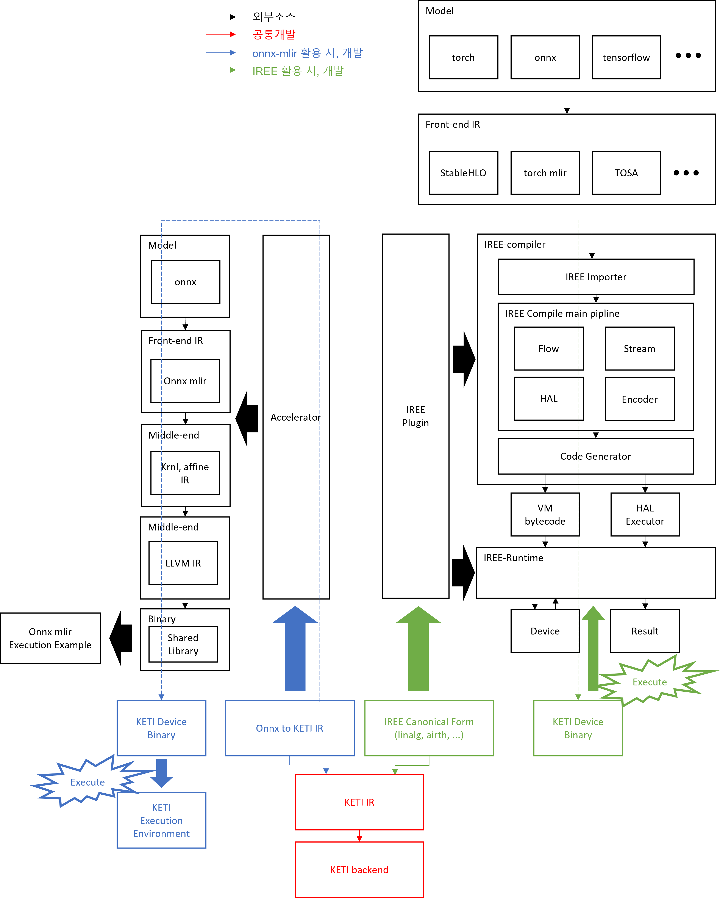

- **[[개발 파이프라인 정리]]**
- [[Custom IR 설계]]
- [[임시 기록 - Custom IR 설계를 위한 정보들 기입]]
## 1. 개요

- **\[QDQ Quantized onnx model -> MLIR -> IREE -> Binary + json\]** 순서로 compile 되도록 진행
- front-end까지는 IREE를 사용하여 IREE 정규식을 만들어낸다.
- 컴파일러의 개발 범위는 IREE 정규식에서 \[Binary + json\]를 만드는 것까지를 범위로 한다.
- 런타임은 만들어진 파일을 읽고 하드웨어를 제어하는 것까지를 범위로 한다.
- Bianry에는 model 실행을 위한 meta data와 명령어 queue가 저장되어 있다.
- json에는 실제 하드웨어 메모리를 어떻게 사용할 지에 대한 정보가 담겨있다.
- 런타임은 Binary와 json을 읽고 모델 실행을 위해 하드웨어를 제어한다.


- 개발 범주


- 전체 코드 구조 : 2가지 git으로 관리
	- RepresentHW git : 하드웨어에 종속된, general하게 사용할 수 있는 Dialect들과 Pass들을 정의하고 관리 + 하드웨어 구동에 필요한 device driver 등을 관리
	- PublishHW git : iree 등 다양한 middle-end 또는 front-end와 연동 시키기 위한 git 현재는 iree에 연동하는 것만 구상 중

- 참고 : [[컴파일러 적용과 mlir의 변화]]
## 2. 이론 및 개념

- [[정적 그래프]]
- [[StableHLO]]
- [[IREE 코드 구성]]
- [[Session과 Invocation]]
- [[IREE가 IR을 변환시키는 2가지 방법]]
- [[Plugin]]
- [[HAL Ops에서 vtable 함수포인터 호출 흐름]]
- [[컴파일러 관련 기본 이론들 정리]]
- [[IREE 옵션 설정에 대해]] 

## 3. Setup

- ubuntu20.04에서 진행, ubuntu22.04 및 ubuntu24.04 추천
- IREE는 26.01.06 기준 안정화 버전인 v3.9.0을 사용
### 3.1 IREE Build
1) torch mlir 설치
   - python3.11 설치 및 venv 가상환경 설정
   - 가상환경에서 pip 로 torch mlir 설치```
```
$ pip install --pre torch-mlir torchvision \ --extra-index-url https://download.pytorch.org/whl/nightly/cpu \ -f https://github.com/llvm/torch-mlir-release/releases/expanded_assets/dev-wheels onnx protobuf
```
1) IREE 빌드
    - iree를 clone하고 아래 두 줄을 수정
      <코드 수정> iree/compiler/src/iree/compiler/Codegen/Common/LinkTuningSpecsPass.cpp:426에서 nullptr을 모두 false로 바꿈
      <코드 수정> iree/compiler/src/iree/compiler/Dialect/Util/Transforms/HoistIntoGlobals.cpp:354에서 const 제거
    ```
    $ sudo apt install cmake ninja-build clang lld
    $ git clone https://github.com/iree-org/ire.git
    $ git checkout tags/v3.9.0
    $ git submodule update --init
    $ cmake -G Ninja -B ../iree-build/
    $ cmake --build ../iree-build/
    ```

### 3.2 IREE 실행

3.2.1 Host CPU / Device CPU : standard 예제 - onnx 모델 사용
1) python3.11의 가상환경 실행
   ```
   $ source ./venv3.11/bin/activate
   ```
2) 모델을 IREE환경으로 import (front-end 실행)
```
$ cd ../iree-build/tools/
$ (save model to /path/to/iree-build/models/yolov8n.onnx)
$ python -m torch_mlir.tools.import_onnx ../models/yolov8n.onnx -o ../yolov8n.onnx.mlir
```
3) IREE 컴파일 수행
   ```
   $ ./iree-compile ../models/yolov8n.onnx.mlir --iree-hal-target-device=local --iree-hal-local-target-device-backends=llvm-cpu --iree-llvmcpu-target-cpu=host -o ../models/yolov8n_cpu.vmfb
   ```
4) 런타임 수행
   - 실행 전, yolov8n.onnx.mlir을 열어 어떤 function으로 구성되어 있는지 확인 후 실행
   - input은 임의로 0으로 초기화 된 텐서를 입력, 실제 데이터를 확인하려면 .npy로 저장한 데이터를 입력으로 주어 실행
   - 결과값을 npy로 저장하려면 --output=@filename.npy 옵션을 추가
   ```
   $ ./iree-run-module --module=../models/yolov8n_cpu.vmfb --device=local-task --function=main_graph --input=1x3x640x640xf32=0
   ```


### 3.3 Compiler Example & Structure Build
- 구조를 설계하고 해당 구조에서 Dialect 등록 및 Pass 적용이 잘 이루어지는지 확인하기
- linalg.matmul -> hw1.matmul로 변경하는 실험을 진행. simple MLP를 변환하려 했으나 이를 위해서는 많은 계층의 IR들을 구현해야 할 필요가 있어, 간단하게 pass 1개가 적용되는지만 실험
- 3.1 / 3.2 를 진행하지 않고도 진행할 수 있지만, torch-mlir을 설치하고 진행하길 권장
<br>
3.3.1 Build
- 최초 1번은 LLVM, MLIR, IREE까지 모두 빌드하기 때문에 오래걸림
```
$ git clone --recursive https://github.com/sedie1234/PublishHW.git 
$ git checkout [dbde48d]
$ cd PublishHW
$ mkdir build
$ cmake -G Ninja -B ./build -S third_party/iree   \
-DIREE_CMAKE_PLUGIN_PATHS=$PWD   \
-DIREE_BUILD_PYTHON_BINDINGS=OFF   \
-DIREE_INPUT_STABLEHLO=ON   \
-DIREE_INPUT_TORCH=ON   \
-DIREE_INPUT_TOSA=OFF   \
-DIREE_HAL_DRIVER_DEFAULTS=ON   \
-DIREE_TARGET_BACKEND_DEFAULTS=OFF   \
-DIREE_TARGET_BACKEND_LLVM_CPU=ON   \
-DIREE_BUILD_TESTS=ON   \
-DIREE_BUILD_SAMPLES=OFF  \
-DTARGET_DEVICE="HW1"
```
<br>
3.3.2 실행
- 아래 코드를 복사하여 test.mlir을 만듬
```
func.func @test_matmul(%arg0: tensor<128x128xf32>, %arg1: tensor<128x128xf32>, %arg2: tensor<128x128xf32>) -> tensor<128x128xf32> {
  %0 = linalg.matmul ins(%arg0, %arg1 : tensor<128x128xf32>, tensor<128x128xf32>)
                     outs(%arg2 : tensor<128x128xf32>) -> tensor<128x128xf32>
  return %0 : tensor<128x128xf32>
}
```
- iree-opt를 통해 linalg-to-hw1 pass를 적용 : iree-opt는 컴파일러 개발의 디버깅을 위해 기능을 하나씩 테스트 할 수 있도록 만들어진 도구
```
$ ./build/tools/iree-opt test.mlir --pass-pipeline="builtin.module(linalg-to-hw1)" > test_example.mlir 2>&1
```
- 아래와 같이 pass가 적용된 것을 확인
```
module {
  func.func @test_matmul(%arg0: tensor<128x128xf32>, %arg1: tensor<128x128xf32>, %arg2: tensor<128x128xf32>) -> tensor<128x128xf32> {
    %0 = hw1ir.matmul %arg0, %arg1 : tensor<128x128xf32>, tensor<128x128xf32> -> tensor<128x128xf32>
    return %0 : tensor<128x128xf32>
  }
}
```

## 4. 주의사항
- [[양자화 관련]]


## 5. 컴파일러 구현에 필요한 사전 작업 및 실험들
- ~~StableHLO 적용 실험 (TODO : 링크, 문서작성)~~
	- ~~onnx와 torch 모델에 대해 StableHLO를 적용해 HLO Level의 MLIR을 생성하고 cpu모드로 컴파일 시켜보기~~
	- ~~모델은 yolo와 qdq quantized yolo로 실험~~
	- ~~import 직후의 mlir 확인~~
	-> onnx를 importer로 쓰는 것으로 결정됨 (260309)

- [[torch simpleMLP test]]

## 6. File naming & 구성요소 정리 (용어정리)
- File naming 
	- xxxIR.td : xxx Dialect의 operation이 구현되어 있는 tablegen file
	- xxxIROpBase.td : xxx Dialect의 operation이 사용할 수 있는 Attribute나 Interface를 정의하고 있는 tablegen file
	- xxxTransformOps.td : xxx Dialect의 변환규칙을 Transform Dialect의 operation으로 정의하고 있는 tablegen file
	- xxxDialect.h / .cpp : 정의한 xxx Dialect를 등록하기 위한 파일
	- Passes.td : Pass들을 정의한 tablegen file 
	- Passes.h / .cpp : 정의한 Pass들을 등록하기 위한 파일
	- xxxPass.h / .cpp : 특정 변환을 위한 Pass를 구성하는 Conversion들을 정의한 파일

- 구성요소 : [[MLIR 구성요소와 사용법 정리]]

# 7. 개발 단계

## 7.1 동작만 하는 수준의 구현

- IR은 후일의 최적화까지 고려하여 구성하지만 pass 자체는 최적화를 고려하지 않고 진행한다.
- [[변환해야 할 Ops 정리 - Conv-Activation 편]]

## 7.2 VLIW 최적화

- 병렬성이 있는 연산을 찾아 VLIW를 적용한다.

## 7.3 일반적인 최적화 기술 적용

- loop unrolling이나 연산 순서 바꾸는 등, 기본적인 기술들을 적용해본다.

## 7.4 실험적인 최적화 기술들을 적용

- 실험적인 최적화 기술들을 적용해본다.

## 7.5  프로파일링 기법

- 다양한 방법으로 컴파일 할 수 있도록 하고, profiling용 ops를 이용하여 프로파일링 후, 가장 최적의 방법을 채택하여 컴파일한다.