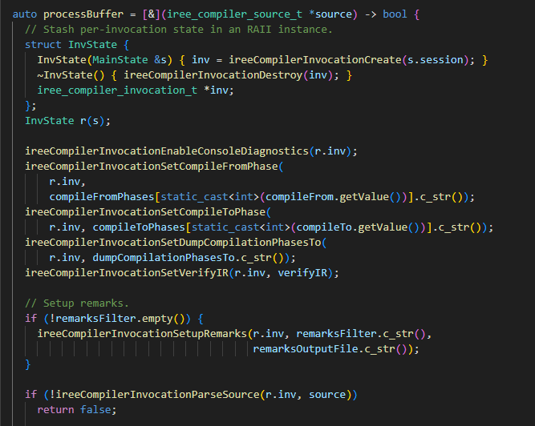
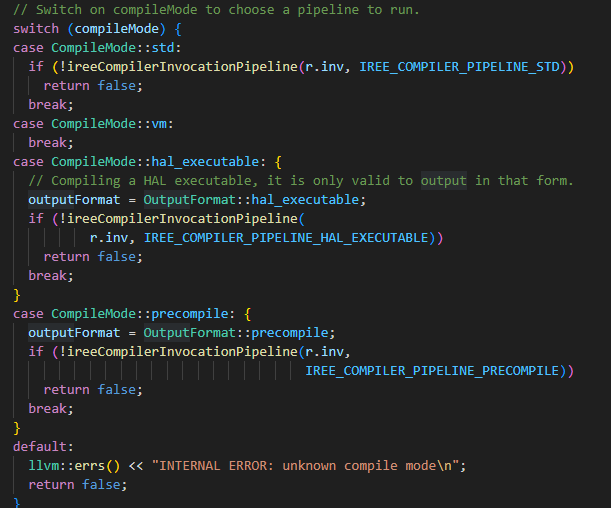
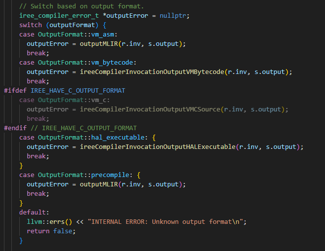

- /path/to/iree/compiler/src/iree/compiler/Tools/iree_compiler_lib.cc : runIreecMain 함수 분석
- 해당 함수에 인용되는 핵심 함수들은 링크를 걸어 분석해 둘 예정

# 1. 코드 구조
- 코드 구조는 크게 4단계로 나누어져 있음.
- 컴파일 옵션 / 초기화 / 컴파일 람다함수 / 조건분기 컴파일 실행(현재는 multi-input 유무 정도로 분기됨)

# 2. 컴파일 옵션
- 컴파일 옵션은 llvm::cl::opt를 이용
	
	사용 가능한 옵션과 초기 설정 값, 각 옵션에 대한 설명이 기재되어 있음

# 3. 초기화
- session의 state를 관리하는 객체 초기화 : [[Session과 Invocation]]의 개념 참고
- RAII 패턴으로 관리

# 4. 컴파일 람다함수
- 실제 컴파일을 수행하는 함수로, compile의 source를 입력받아 output을 session state에 저장하고 성공여부를 bool 타입으로 반환
- [&]를 사용하여 지역변수를 모두 참조할 수 있도록 구성
- 1) 아래와 같이 초기 부분에서는 session에서 invocation으로 필요한 정보들을 불러옴
  [[ireeCompilerGlobalInitialize 분석]] -> 많은 Dialect, Target Device, Pass 들이 여기에서 등록됨
  
- 2) compile mode에 따라 Invocation Pipeline을 수행 -> 내부함수 [[runPipeline 분석]]
  
- 3) output format에 따라 session state에 output을 저장
  

# 5. 컴파일 실행
- 4번에서 작성한 람다함수(processBuffer)로 컴파일 수행, output에 저장 (output 포인터를 파일포인터를 주었으므로 파일에 저장됨)
  

# 6. 번외
- C API로 제공되는 것을 활용하여 컴파일 작성하는 [예제](https://iree.dev/reference/bindings/c-api/#plugins) 
- IREE 라이브러리를 읽어와서, session과 invocation을 열고 compile을 수행하는 예제 : 컴파일러를 라이브러리화 하고 사용하고자 하는 방향성이 보임
```
#include <iree/compiler/embedding_api.h>
#include <iree/compiler/loader.h>

int main(int argc, char** argv) {
  // Load the compiler library then initialize it.
  ireeCompilerLoadLibrary("libIREECompiler.so");
  ireeCompilerGlobalInitialize();

  // Create a session to track compiler state and set flags.
  iree_compiler_session_t *session = ireeCompilerSessionCreate();
  ireeCompilerSessionSetFlags(session, argc, argv);

  // Open a file as an input source to the compiler.
  iree_compiler_source_t *source = NULL;
  ireeCompilerSourceOpenFile(session, "input.mlir", &source);

  // Use an invocation to compile from the input source to one or more outputs.
  iree_compiler_invocation_t *inv = ireeCompilerInvocationCreate(session);
  ireeCompilerInvocationPipeline(inv, IREE_COMPILER_PIPELINE_STD);

  // Output the compiled artifact to a file.
  iree_compiler_output_t *output = NULL;
  ireeCompilerOutputOpenFile("output.vmfb", &output);
  ireeCompilerInvocationOutputVMBytecode(inv, output);

  // Cleanup state.
  ireeCompilerInvocationDestroy(inv);
  ireeCompilerOutputDestroy(output);
  ireeCompilerSourceDestroy(source);
  ireeCompilerSessionDestroy(session);
  ireeCompilerGlobalShutdown();
}
```
